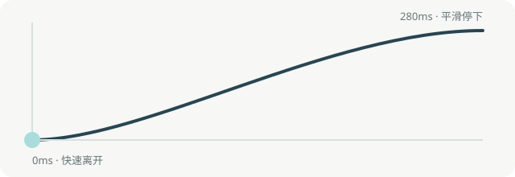

# 缓动规范

动效的任务是解释状态变化，而不是吸引注意力。FrontPost 的工作区展开、收起、浮层出现和文字进入都遵循“短、轻、可取消”的原则：内容仍然可读，动效不承担唯一的信息表达。

## 1. 基础参数

### 快速离开，末端减速

```css
--motion-ease-out: cubic-bezier(.22, 1, .36, 1);
--motion-duration-quick: 160ms;
--motion-duration-panel: 280ms;
--motion-duration-page: 240ms;
```

这条曲线在开始阶段快速移动，在终点附近平滑减速，适合侧栏展开、弹层进入和按钮反馈。曲线的四个参数分别是两个控制点的 `x/y` 坐标；`x` 必须在 `0..1` 之间。需要查曲线含义时，参阅 [MDN cubic-bezier](https://developer.mozilla.org/en-US/docs/Web/CSS/Reference/Values/easing-function/cubic-bezier) 和 [MDN easing functions](https://developer.mozilla.org/en-US/docs/Web/CSS/Guides/Easing_functions)。

### 状态使用方式

| 场景 | 时长 | 曲线 | 动画属性 |
| --- | ---: | --- | --- |
| 图标/按钮 hover | 120–180ms | `ease-out` | `opacity`, `color`, `background-color`, `transform` |
| 侧栏展开/收起 | 280ms | `cubic-bezier(.22,1,.36,1)` | `grid-template-columns`, `padding`, `opacity` |
| 侧栏文字错峰进入 | 150ms，延迟 65–95ms | `ease-out` | `opacity`, `transform` |
| 底部悬浮输入层 | 240ms | `ease-out` | `opacity`, `transform`, `backdrop-filter` |

收起时不等待文字动画结束：文字先降低透明度并向边缘退出，容器同步收窄。展开和收起使用同一方向的空间关系，避免关闭时出现与打开不一致的“甩出”方向。

## 2. 实现约束

- 优先动画 `transform` 与 `opacity`；只有侧栏本身需要动画尺寸时才改变 `grid-template-columns`。
- 侧栏文字保留在 DOM 中，通过 `opacity`、`transform`、`visibility` 处理，避免 `display: none` 造成跳变。
- 文字错峰只用于建立层级，不超过 100ms；不能让用户等待内容出现。
- 所有动效必须有 `@media (prefers-reduced-motion: reduce)` 分支，关闭过渡但不隐藏信息。
- 动效不能遮住正文。悬浮输入层使用透明渐变和 `backdrop-filter`，让下方对话仍然可辨认而不是出现白色空洞。
- 交互可以在动画中途再次触发，不能用不可取消的长动画阻塞操作。

## 3. SVG 动态演示

下面的演示用同一条曲线展示“快速移动、末端减速”。实线是运动轨迹，圆点是正在移动的对象；`prefers-reduced-motion` 用户会看到静态终态。



```html
<svg viewBox="0 0 640 220" role="img" aria-label="快速离开、末端减速的缓动曲线">
  <path d="M40 174 C 180 174 410 38 600 38" />
  <circle r="10" cx="40" cy="174">
    <animateMotion dur="1.2s" repeatCount="indefinite" path="M0 0 C 140 0 370 -136 560 -136" />
  </circle>
</svg>
```

动画只用于解释曲线和辅助理解；产品界面中的实现应使用 CSS token，避免每个组件单独发明一套参数。
